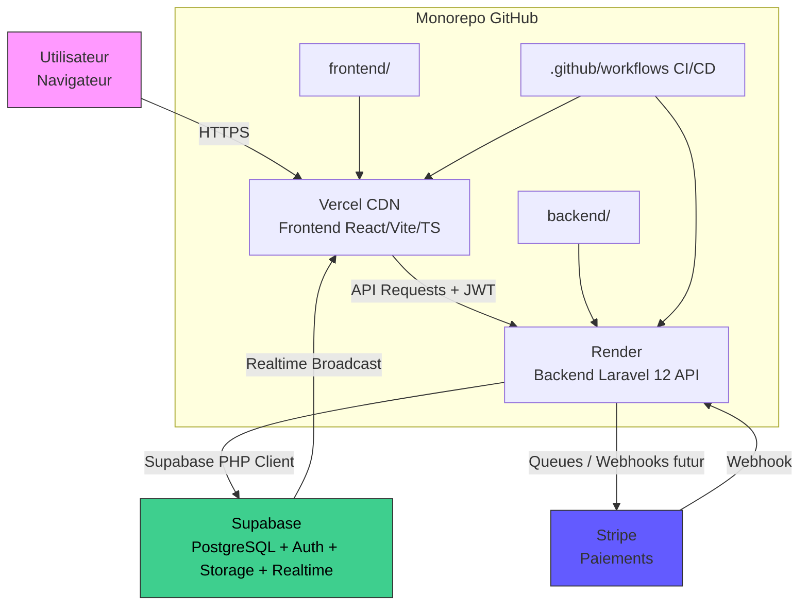

# Cahier des Charges Techniques - Mise en Production (v6.0)

## 1. Contexte et Objectifs
Le projet **Study Abroad Navigator** (MAIGUP) est une plateforme web destinée à faciliter l'accompagnement des étudiants souhaitant étudier à l'étranger.

**Objectif** : Transformer le prototype frontend en application de production robuste.

**Stack Hybride** :
- **Frontend** : React (Vite)
- **Backend** : Laravel (PHP)
- **BaaS** : Supabase (Auth, DB, Storage, Realtime)

## 2. État Actuel (Analyse de l'existant)
### 2.1 Stack Technique Frontend
- **Framework** : React 18 avec Vite
- **Langage** : TypeScript
- **Style** : Tailwind CSS + Shadcn UI (Radix UI)
- **Navigation** : React Router DOM
- **État & Cache** : TanStack Query (React Query)
- **Formulaires** : React Hook Form + Zod
- **Icônes** : Lucide React

### 2.2 Limites Actuelles
- Données statiques (mocks).
- Pas de backend ni de base de données réelle.
- Authentification simulée.

## 3. Architecture Cible
### 3.1 Schéma d'Architecture Globale
**Modèle Client-Server hybride BaaS + Serverless-like**

- **Monorepo** : `frontend/` (React) + `backend/` (Laravel).
- **Déploiement** : Vercel (Frontend) + Render (Backend).
- **Flux** : Utilisateur → Frontend → API Laravel → Supabase.

### 3.2 Stack Backend Détaillée
- **Framework Principal** : Laravel 12 (ou 11 pour stabilité).
- **Intégration Supabase** : Package `saeedvir/supabase` (ou `supabase/supabase-php` pour un client bas niveau).
- **Authentification** : Déléguée à Supabase (JWT avec Row Level Security - RLS).
- **ORM/DB** : Client Supabase pour les interactions DB, avec Eloquent en fallback pour des requêtes complexes si nécessaire.
- **Autres Composants** : Laravel Sanctum pour sessions API si besoin, mais prioriser Supabase pour l'auth. Intégrer `laravel/cashier-stripe` pour future intégration Stripe.

**Avantages de cette Stack** :
- **Rapidité de développement** : Supabase gère auth, RLS et realtime sans code custom.
- **Puissance Laravel** : Pour validation, queues, scheduling, et logique métier (ex: workflows de dossiers, intégration paiements).
- **Scalabilité** : PostgreSQL + Supabase scaling automatique, queues pour charges asynchrones.

### 3.3 Architecture Monorepo
Pour simplifier la gestion du code, des dépendances et des déploiements, l'ensemble du projet sera structuré en **monorepo** (un seul dépôt Git contenant frontend et backend).

**Structure du Monorepo** :
- **Racine du repo** : Fichiers communs comme `.gitignore`, `README.md`, `docker-compose.yml` (pour dev local), et workflows CI/CD (`.github/workflows`).
- **Dossiers principaux** :
    - `/frontend` : Contient le code React/Vite (package.json, src/, public/, vite.config.ts).
    - `/backend` : Contient le code Laravel (composer.json, app/, routes/, config/, artisan).
    - `/shared` (optionnel) : Types ou utils partagés.
- **Gestion des Dépendances** : Utiliser **npm workspaces** ou **Yarn workspaces**.
- **Environnements Locaux** : Utiliser Docker pour uniformiser (ex: container PHP pour backend, Node pour frontend, Supabase local via Docker).
- **Branches** : `main` pour prod, `develop` pour staging, features branches pour dev.

**Avantages du Monorepo** :
- Déploiements atomiques.
- Tests croisés (end-to-end).
- Moins de overhead (un seul repo).

### 3.4 Recommandations Supplémentaires
- **Choix Technologiques** : Prioriser Supabase pour minimiser le temps de développement (gain de 20-30% vs full custom). Utiliser Laravel pour toute logique métier complexe (ex: algorithmes de matching).
- **Performances** : Implémenter caching avec Laravel Cache/Redis pour stats dashboard. Utiliser indexes DB pour requêtes fréquentes.
- **Sécurité et Conformité** : Audit OWASP initial. Enregistrer la plateforme auprès de l'APDPVP au Gabon. Ajouter MFA pour admins.
- **Scalabilité Future** : Préparer pour >1000 utilisateurs. Intégrer Stripe tôt pour tests en staging.
- **Développement** : Adopter un monorepo pour facilité CI/CD. Utiliser Docker.
- **Meilleures Pratiques** : Suivre SOLID principles en Laravel. Tester unitaires/end-to-end avec PHPUnit et Cypress. i18n ready (fr/en).
- **Coûts Estimés (2026)** : Supabase Pro ~25$/mois, Vercel Pro ~20$/mois, Render ~15$/mois. Total initial <60$/mois pour <500 users.

## 4. Spécifications Fonctionnelles Techniques
### 4.1 Modèle de Base de Données Complet
La base de données PostgreSQL (via Supabase) utilise des UUIDs pour les IDs primaires.

| Table | Champs | Index | RLS Policies (Simplifié) |
|-------|--------|-------|--------------------------|
| **users** | id (PK), email (unique), password_hash, role ('ADMIN','STUDENT'), created_at, updated_at | email, role | Self-access; Admin update |
| **profiles** | id (PK), user_id (FK), first_name, last_name, phone, country_origin, date_of_birth, education_level, gpa, field_of_study, budget_min/max, avatar_url | user_id | Self-access |
| **registrations** | id (PK), user_id (FK), target_country, program, university_name, intake_period, status (PENDING...), current_step (DOCUMENTS...), admin_notes, rejection_reason | user_id, status | Self-access OR Admin |
| **documents** | id (PK), registration_id (FK), file_name, file_url, type, uploaded_at, verified | registration_id | Owner OR Admin |
| **services** | id (PK), title, description, price, icon | title | Public Read; Admin Write |
| **testimonials** | id (PK), author_name, content, rating, is_published | is_published | Public Read (if published); Admin Write |
| **inquiries** | id (PK), name, email, subject, message, status | status | Admin Read/Update; Public Insert |
| **notifications** | id (PK), user_id (FK), message, read | user_id, read | Self-access |
| **payments** | id (PK), user_id (FK), registration_id, stripe_id, amount, status | user_id, status | Self-access OR Admin |

**Notes DB** :
- Timestamps `created_at` et `updated_at` automatiques.
- Triggers Supabase pour logs audits.

### 4.2 Liste de Toutes les Fonctionnalités
- **Authentification** : Inscription, connexion, refresh token, déconnexion, vérification email, gestion consentement.
- **Gestion Utilisateurs** : Profil personnel (view/edit), liste admins (view only pour ADMIN).
- **Gestion Dossiers (Registrations)** : Création demande, liste (perso ou toutes), update statut (ADMIN), workflow étapes, notes/rejets.
- **Gestion Documents** : Upload, view, vérification (ADMIN).
- **Contenu Statique** : Liste services (public), CRUD services (ADMIN), liste témoignages publiés (public), CRUD témoignages (ADMIN).
- **Contacts/Inquiries** : Soumission formulaire contact (public), liste/gestion (ADMIN).
- **Notifications** : Envoi realtime (ex: statut change), liste/lire (user perso).
- **Dashboard Admin** : Stats (KPIs : nb dossiers par statut/pays, users actifs, etc.).
- **Paiements (Future)** : Création session Stripe, traitement webhooks, liste transactions.
- **Realtime** : Notifications live pour updates dossiers.
- **Conformité** : Endpoints DSAR (accès/suppression données), logs audits.
