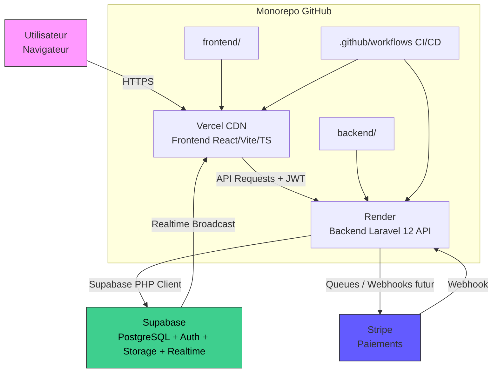

# Cahier des Charges Techniques - Mise en Production (v6.0)

## 1. Contexte et Objectifs
Le projet **Study Abroad Navigator** (MAIGUP) est une plateforme web destinée à faciliter l'accompagnement des étudiants souhaitant étudier à l'étranger.

**Objectif** : Transformer le prototype frontend en application de production robuste.

**Stack Hybride** :
- **Frontend** : React (Vite)
- **Backend** : Laravel (PHP)
- **BaaS** : Supabase (Auth, DB, Storage, Realtime)

## 2. État Actuel (Analyse de l'existant)
### 2.1 Stack Technique Frontend
- **Framework** : React 18 avec Vite
- **Langage** : TypeScript
- **Style** : Tailwind CSS + Shadcn UI (Radix UI)
- **Navigation** : React Router DOM
- **État & Cache** : TanStack Query (React Query)
- **Formulaires** : React Hook Form + Zod
- **Icônes** : Lucide React

### 2.2 Limites Actuelles
- Données statiques (mocks).
- Pas de backend ni de base de données réelle.
- Authentification simulée.

## 3. Architecture Cible
### 3.1 Schéma d'Architecture Globale
**Modèle Client-Server hybride BaaS + Serverless-like**

- **Monorepo** : `frontend/` (React) + `backend/` (Laravel).
- **Déploiement** : Vercel (Frontend) + Render (Backend).
- **Flux** : Utilisateur → Frontend → API Laravel → Supabase.

### 3.2 Stack Backend Détaillée
- **Framework** : Laravel 12 (ou 11).
- **Supabase Integration** : `saeedvir/supabase` ou `supabase/supabase-php`.
- **Auth** : Supabase Auth (JWT + RLS).
- **DB** : PostgreSQL via Supabase.
- **Paiement** : Laravel Cashier (Stripe) prévu.

### 3.3 Flux Typique (Ex: Inscription)
1.  **Frontend** : Formulaire React Hook Form + Zod.
2.  **API** : POST `/api/registrations` vers Laravel (Render).
3.  **Backend** : Validation -> Insert Supabase DB -> Upload Storage.
4.  **Realtime** : Supabase notifie le Frontend via Websocket.
5.  **UI** : Mise à jour instantanée.
